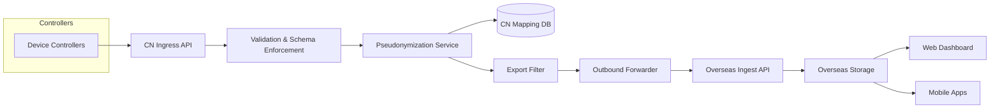

# Mode A Operational Guidance (v1.0)

> This is operational guidance, not legal advice. Final determinations require qualified counsel.

## 0. Executive Summary

- CN entity retains custody of raw identifiers, mapping DB, and HMAC secrets within mainland infrastructure.
- Overseas stakeholders only see pseudonymized telemetry (SAFE metrics) for dashboards + mobile.
- Raw `/api/ingest` on the overseas Worker now returns `410 raw_ingest_disabled`; only signed CN-export batches are accepted.
- Cloudflare Workers host the overseas API (`APP_API_BASE`); the CN gateway exposes `CN_GATEWAY_BASE`.
- Mode A keeps PIPL filings out of scope by ensuring exports contain no personal data or mapping tables.
- Exported data is pseudonymous. Re-identification is possible only inside CN under dual control; the mapping table never leaves CN. Cross-border filings for this telemetry stream are likely avoided, subject to counsel sign-off.

**Trade-offs**
- Regulatory certainty prioritized over analytics richness; customer support escalation requires CN re-identification path.
- Operational overhead for key management (dual control + rotation) stays in CN.
- Pseudonymized metrics may reduce troubleshooting fidelity for overseas teams.

**Checklist**
- [x] CN legal entity owns keys/mapping DB/infrastructure footprint.
- [x] Overseas stakeholders aligned on pseudonymized scope.
- [x] Hosting, SLOs, release sequencing aligned for CN gateway and overseas API.

## 1. Legal & Regulatory Mapping (PIPL/DSL/CSL)

| Requirement | Mode A Response | Residual Risk | Control Owner |
| --- | --- | --- | --- |
| PIPL Art. 38 | Export stream lacks personal data; mapping stays in CN (no SCC/DPIA) | Regulator may still treat pseudonyms as PI if combined with other sets | CN entity |
| PIPL Art. 51 | SAFE metrics enforced; DROP list rejects sensitive fields | Schema drift could reintroduce PII | CN entity + Overseas validation |
| PIPL Art. 55 | Dual control, audit logs, CN KMS | Insider misuse | CN entity |
| DSL (important data) | Telemetry only; classification documented | Device anomalies interpreted as important data | Joint |
| CSL (network security) | Hardened gateway, mTLS, logging | Dependency supply chain risks | CN entity |

**Roles**
- CN entity: processor/controller for raw data, mapping DB, re-identification tooling, breach notices.
- Overseas entity: processor of pseudonymized metrics, responsible for RBAC + no re-identification attempts.

## 2. Data Inventory & Field Mapping

| Field | PII? | Exported? | Transform |
| --- | --- | --- | --- |
| `device_id_raw` | Yes | No | HMAC-SHA256 → `did_pseudo` |
| `device_serial`, `operator_*`, `address`, `gps`, `ip`, `mac` | Yes | No | DROP |
| `supplyC`, `returnC`, `flowLps`, `powerKW`, `COP`, `pressure*`, `status_code`, `fault_code`, `control_mode`, `timestamp_minute`, `energyKWh`, `cycleCount`, `uptimeMinutes` | No | Yes | Schema validated, timestamp rounded |

DROP list: `name`, `address`, `phone`, `email`, `ip`, `mac`, `serial`, `deviceIdRaw`, `notes`, `gps`, `lat`, `lng`, `photo`, `image`, `freeText`, `rawPayload`, `hostname`, `ssid`, `wifi_ssid`, `bssid`, `router_mac`, `imei`, `imsi`, `meid`, `geohash`, `ssid_password`. Regex detectors catch embedded IP/MAC/IMEI strings anywhere in payloads; violations return HTTP 422 with an audit log entry.  
SAFE metrics exported exactly match `services/cn-gateway/src/modea/drop-safe.ts`; the SDK no longer exposes any additional metrics beyond that list.

Edge cases: regex scrubbing for embedded MAC/IP, reject binary blobs, disable free-text diagnostics (HTTP 422).

## 3. System Architecture (Mode A)



**Sizing**: 20k devices @ 1 payload/min (~40 MB/min). HMAC-SHA256 ~500k ops/sec/CPU (allocate 2 cores). Mapping cache ≈1.3 MB for 20k devices. K8s HPA at ≥60% CPU, add replica per +10k devices.

## 4. Pseudonymization Design

`did_pseudo := base64url(HMAC_SHA256(device_id_raw, key=CN_KMS[v]))` truncated to the first 22 characters (~132 bits).

- Database enforces `UNIQUE(did_pseudo)`. On conflict, append a 2-character base32 counter suffix (length 22–24) and retry, ensuring deterministic linkage plus collision safety.
- Keys rotated every 6 months (dual control). Mapping table stores `key_version` for historical linkages.
- Re-identification requires signed ticket (security + compliance) executed inside CN enclave.
- Replay protection via `seq` window (size 5) + timestamp tolerance ±120 seconds; out-of-window payloads and repeated `seq` values receive HTTP 409 and trigger audit logs.
- CN gateway signs every outbound batch with Ed25519 (`X-Batch-Signature: base64(signature)`); the overseas API verifies signatures using a pinned CN public key. Signing keys live in CN KMS (alias `modea-batch-signing`) and rotate alongside pseudonymization keys.

## 5. APIs

### CN Gateway
- `POST /ingest`: mTLS + HMAC header, JSON schema from `packages/sdk-core`. Reject if `timestamp` deviates >±120 seconds from gateway time. Maintain per-device ring buffers (size 5) to reject duplicate `seq` values with 409 responses. Rate limit 120 rpm/device. Returns `202`.
- `POST /export`: forwarder pushes sanitized batches. Tracks `batchId` for idempotency and enforces the “important data” guard (no bucket exported with <5 devices per site/category).
- `GET /health`: internal status incl. key version.
- `GET /metrics`: Prometheus exposition (PII free).
- Idempotency: every POST endpoint requires `Idempotency-Key`. Keys persist for 24 hours (Redis/DB keyed by profile + device). Replays within the TTL return the original 2xx/4xx result and emit a structured log entry.
- `POST /admin/rotate-key`: dual-control endpoint.

### Overseas API (Cloudflare Worker)
- `POST /api/ingest/:profileId`: receives pseudonymized batches w/ Access JWT and requires `X-Batch-Signature` (Ed25519) verified against the pinned CN public key.
- `POST /api/heartbeat/:profileId`: key-version drift monitoring.
- `GET /health`, `GET /metrics`.

## 6. Schemas & Storage

**CN Postgres tables**: `mapping`, `audit_log`, `export_log`, `errors` (encrypted tablespaces, 24‑month retention). `audit_log.ip_hmac` persists `HMAC(ip, cn_kms_audit_key)` for abuse correlation; rotate the audit key quarterly and treat the field as personal data inside CN. Optional guardrail:
```sql
ALTER TABLE mapping
  ADD CONSTRAINT did_len_chk CHECK (length(did_pseudo) BETWEEN 22 AND 24);
```
**Overseas D1/KV**: `devices`, `latest_state`, `telemetry`, `alerts`, `ops_metrics` with JSONB indexes and retention windows (18–24 months).

## 7. Security Controls Matrix

| Control | Implementation | Evidence | Frequency | Owner |
| --- | --- | --- | --- | --- |
| Access control | RBAC + mTLS/JWT | IAM review | Quarterly | Security CN |
| Cryptography | CN KMS / TLS 1.3 | KMS logs | Monthly | Security CN |
| Logging | Structured logs + SIEM | Dashboards | Weekly | CN Ops |
| Change mgmt | PR reviews + CI guardrails | PR history | Per change | Engineering |
| Incident response | Runbooks, tabletop drills | Exercise reports | Semi-annual | Security CN |

Access matrix ensures CN security/compliance maintain dual-control re-identification approvals; overseas ops are read-only on pseudonymized stores.

## 8. Key Management & Rotation SOP

1. Use Alibaba/Tencent/Huawei KMS or on-prem HSM.
2. Keys labeled `modea-hmac-vX`, metadata tracked.
3. Rotation: change request → approvals → staging validation → config update via sealed secrets → background rehash job → drift monitoring via heartbeat endpoint.
4. Break-glass vault w/ physical token + OTP.
5. Secrets delivered via sidecar/CSI; never written to disk.

## 9. Hosting & Deployment

- **Hosting decision**: Alibaba Cloud (Aliyun) selected for the CN gateway footprint. Managed Postgres + KMS, strong local support, and straightforward ICP/egress workflows outweigh vendor lock-in concerns.

| Option | When to pick | Pros | Cons |
| --- | --- | --- | --- |
| On-prem (factory/DC) | Existing CN site + ops | Full control, no external vendors | Hardware, HA, power, ops burden |
| Alibaba Cloud *(chosen)* | Need managed Postgres/KMS + mature CN support | Rich managed services, docs | Vendor lock-in, ICP/network approvals |
| Tencent Cloud | Already in Tencent ecosystem | Good CN presence, security tooling | Service naming quirks |
| Huawei Cloud | Hybrid/on-prem synergy | Solid hybrid stack | Similar vendor lock-in considerations |

Minimal footprint (any option): CN gateway app (Docker/K8s), Postgres (managed preferred), managed KMS/HSM, optional Nginx/mTLS terminator. Acceptance criteria: private subnet carved out, outbound 443 egress open to overseas API, health/metrics reachable internally, and a named 24/7 ops owner.

- CN gateway containerized (Dockerfile + compose). Nginx terminates TLS ahead of app. Postgres either managed or cluster-local.
- `services/cn-gateway/nginx.conf` enforces mTLS (`ssl_client_certificate`, `ssl_verify_client on`, TLSv1.2+ only) with cert/key bundles mounted read-only inside the container.
- Overseas API on Cloudflare Workers (wrangler).  
- CI/CD pipeline: lint → test → build → security scan → deploy (staging) → approval → prod.

## 10. Observability & SLOs

Metrics: `ingest_latency_ms`, `export_latency_ms`, `ingest_drop_rate`, `mapping_cache_hit_ratio`, `key_version_drift`, `pii_rejection_count`. All Prometheus metrics share the fixed label set `{component, region, profile, key_version}` to avoid high-cardinality explosions; `did_pseudo` never appears in metric labels.  
Prometheus alerts for high drop rate or key drift; Grafana dashboard template provided. Logs are structured JSON with fields `{timestamp, level, component, region, profile, key_version, event, batchId, errorCode}`; PII/`did_pseudo` never appears. Retention 180d CN / 90d overseas.

## 11. DPIA-Lite & TIA Templates

- DPIA sections: context, data categories (SAFE list), processing activities, legal basis, risk assessment, mitigations, approvals.
- TIA sections: transfer description, recipient-country risk, safeguards, residual risk, monitoring cadence.

## 12. Operational Runbooks

- Daily log review & SLO check.
- Scaling guidance (replica thresholds, queue monitoring).
- DB maintenance (weekly vacuum, monthly index review, quarterly restore test).
- DR: failover to warm standby; verify mapping integrity before exports resume.
- Incident: suspected re-identification → freeze exports → audit logs → notify privacy/legal → rotate keys if needed.

## 13. Risk Register

| Risk | L | I | Mitigation | Early Warning | Owner |
| --- | --- | --- | --- | --- | --- |
| Misconfigured filters export PII | 2 | 5 | Schema validation + CI guardrails | Spike in PII rejections | Data Gov |
| Key compromise | 1 | 5 | HSM, rotation SOP | KMS anomaly alerts | Security CN |
| Mapping exfiltration | 1 | 5 | Network isolation, encryption, four-eyes | Unexpected DB access logs | Security CN |
| Schema drift | 3 | 4 | Contract tests, versioned schemas | CI failures | Engineering |
| Supply-chain vulns | 3 | 4 | SBOM + patch SLA | CVE alerts | Security CN |

Top burndown: monitor IP bucket alerts, automate compare-mode diff tests, add deployment checklist verifying shim flags.

## 14. Roadmap & Estimation (20 hrs/week/engineer)

| Milestone | Optimistic | Likely | Pessimistic | Dependencies |
| --- | --- | --- | --- | --- |
| M1: Hello-world CN ingest | 80 | 120 | 160 | Infra |
| M2: Pseudonymized export pipeline | 100 | 160 | 220 | M1 |
| M3: Overseas API & storage | 60 | 90 | 130 | M2 |
| M4: SDK core + shims | 80 | 120 | 160 | M3 |
| M5: Dashboard web MVP | 90 | 140 | 200 | M4 |
| M6: Mobile MVP | 80 | 130 | 180 | M4 |
| M7: Key rotation dry-run | 40 | 60 | 100 | M2 |
| M8: Privacy notice | 20 | 30 | 50 | Legal |
| M9: Go-live readiness | 40 | 60 | 80 | All prior |

## 15. Checklists

- **DoR**: pseudonymized scope defined, legal review, SAFE metrics acceptance criteria, dependencies/test data identified.
- **DoD**: CI passing (incl. compliance guard), docs/runbooks updated, security review when touching pseudonymization/mapping, telemetry dashboards updated.
- **Go-Live**: SLOs met in staging, key version sync, incident contacts confirmed, privacy notice published, monitoring plan active.

## 16. Decision & Sign-off Form

```
Mode A Confirmation Form
------------------------
Project: ___________
CN Legal Entity: ___________
Overseas Entity: ___________
Estimated Device Count: ☐ <5k ☐ 5k-10k ☐ 10k-20k ☐ >20k
Hosting Choice: ☐ On-prem ☐ Alibaba ☐ Tencent ☐ Huawei (details: ____________)
Mode A Boundary Confirmed: ☐ Yes ☐ Pending (owner/date)
Key Version In Use: _______ (rotation date: _______)
Privacy Notice Issued: Date ____ Owner ____
Residual Risk Level: ☐ Low ☐ Medium ☐ High (explain)
Approvals: Engineering / Security / Compliance / Legal
Notes / Conditions: ________________________________
```

## 17. Monorepo Scaffold

Uses PNPM workspaces with shared TS configs. Tree:

```
apps/ (dashboard-web, mobile)
packages/ (sdk-core, sdk-web, sdk-rn, ui-tokens, ui-react, ui-rn)
services/ (cn-gateway, overseas-api)
docs/
shared/configs
```

## 18. Shared Types & Validation

- `packages/sdk-core` exports Safe/Drop lists, zod schemas, pseudonymization helpers, timestamp normalization.
- `normalizeTimestamp` and `SequenceWindow` enforce rounding + replay protection.

## 19. Web SDK (`packages/sdk-web`)

- Fetch wrapper w/ Access token injection.
- Methods: `getDevices`, `getLatest`, `getAlerts`.
- Validation via shared schemas; rejects unexpected fields.

## 20. React Native SDK (`packages/sdk-rn`)

- Fetch wrapper w/ exponential retry + pluggable storage.
- Same method surface as web; offline caching via AsyncStorage adapter.

## 21–22. UI Tokens & Components

- Tokens stored as JSON; React + RN components use ThemeProvider + tokens.
- Components: `GBButton`, `GBCard`, `GBKpiTile`, `GBStatusPill`, `GBListItem`, `GBChart` (stub for future).

## 23. Dashboard Web App

- Vite SPA using shared SDK/UI libs.
- Pages: Overview (KPI tiles, alerts), Devices, Device detail, Alerts.
- Route guard ready for Cloudflare Access.
- Pseudonymization notice displayed globally.

## 24. Mobile App

- Expo-managed RN app mirroring dashboard content w/ offline cache + haptics hooks.
- Screens: Dashboard, Device detail, Alerts.

## 25. Compliance Guardrails in CI

- Static scan for forbidden fields, property-based tests for transformers.
- Integration tests verifying Access JWT + schema enforcement.

## 26. Example Usage & Demos

- Sample code for web + RN clients using shared SDKs.
- `seeds/pseudonymized-devices.json` for demos (pseudonymous IDs only).

## 27. ADRs

- `docs/adr/ADR-001-mode-a-shared-sdks.md` captures decision to adopt Mode A + shared TypeScript SDK approach (see repo).

## 28. README & Developer Guide

- Root README (this repo) plus package-level READMEs for quickstart instructions.
- Documented SAFE metric update workflow.

## 29. Release Plan

- Semantic versioning per package; use changesets + monthly release cadence.
- Changelog template: Added / Changed / Fixed.

## 30. Bilingual Artifacts

Privacy notice excerpt (English & 简体中文) + admin UI strings provided in `docs/privacy-notice`.

---

**Quality Footer**  
Assumptions: CN entity controls keys/mapping; telemetry sanitized before export; PNPM workspace is single source of truth.  
Open Questions: hosting final decision, legal classification of pseudonyms, fleet growth curve.  
Risks: Key compromise, schema drift introducing PII, network outages affecting SLAs.  
Next 3 Actions: confirm hosting provider, provision CN KMS + keys, build CN gateway MVP ingest pipeline.
